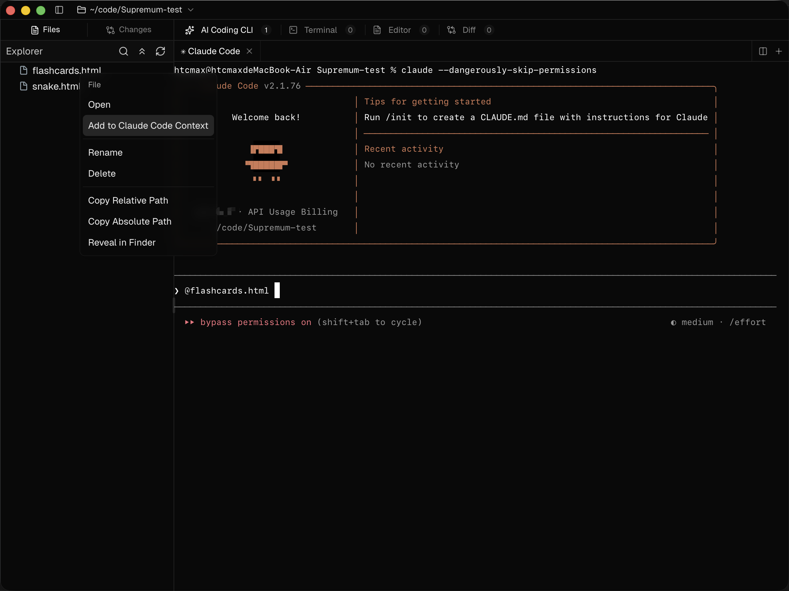

<div align="center">


### Simple, lightweight, but powerful AI code editor for the AI era.

🌐 **English** | [**中文**](./README.zh-CN.md)

<sub><strong>Supremum v0.0.1 is out.</strong> Download it from <a href="https://github.com/HybridTalentComputing/Supremum/releases">Releases</a>.</sub>

> <sub><strong>macOS note:</strong> If macOS says `Supremum.app` is damaged or blocks it from opening, see the <a href="#macos-install-note">macOS Install Note</a> section below for instructions.</sub>

</div>


## Why Supremum?

Supremum is a local desktop workspace built around real coding CLIs, real terminals, local files, and integrated code review.

It keeps the CLI workflow intact, then adds the missing UI layer around it.

| Problem | What Supremum does |
| --- | --- |
| Raw coding CLIs are powerful but manual | Adds launcher tabs, recent session resume, context handoff, and integrated review |
| VS Code / Cursor can feel heavy for terminal-first work | Keeps a lightweight workspace around real terminal sessions |
| Files, terminal output, and diffs are fragmented | Brings Files, Editor, Changes, Diff, and AI sessions into one place |
| Context passing is repetitive | Lets you send files, folders, code selections, and terminal output directly into Claude Code |
| Multi-session work gets messy fast | Supports split panes for AI Coding CLI and Terminal |

## Installer Size Snapshot

Based on locally built/downloaded installers:

| App | macOS ARM64 DMG | Windows x64 Setup |
| --- | --- | --- |
| **Supremum** | **`4.71 MB`** | **`3.3 MB`** |
| Cursor | `248.91 MB` | — |
| VS Code | `252.38 MB` | — |

**Supremum ships in under 5 MB on both platforms.**

This comparison reflects installer file size only, not runtime memory usage or full extracted app size.

## CLI Workflow Optimizations

| Optimization | What it improves |
| --- | --- |
| Preset launcher tabs | Start a supported coding CLI from the UI instead of a blank shell |
| Recent session resume | Resume Claude Code sessions without remembering resume commands |
| Explorer to Claude Code context | Add files and folders from the file tree directly into Claude Code |
| Batch add from Explorer | Send multiple selected items as context in one step |
| Editor selection to Claude Code context | Send focused code directly from the editor |
| Terminal output to Claude Code | Send selected logs or errors from Terminal into Claude Code |
| Session-oriented launcher flow | New sessions and resumed sessions live in the same entry point |
| Split AI / Terminal panes | Keep multiple sessions visible and manageable |

Claude Code currently has the deepest workflow integration.

<div align="center">
  
</div>

## Core Workspaces

| Workspace | What it does |
| --- | --- |
| AI Coding CLI | Launch supported coding CLIs, resume recent Claude Code sessions, split AI panes |
| Terminal | Run native terminals, split panes, send selected terminal output to Claude Code |
| Editor | Open files in tabs, split editing, use code or preview mode where supported, send selected code to Claude Code |
| Files | Browse the local project with an integrated file tree |
| Changes | Review repository changes inside the workspace |
| Diff | Open a dedicated diff workspace for repository-level review |

## A Typical Workflow

| Step | Action |
| --- | --- |
| 1 | Open a local project |
| 2 | Start a new coding CLI session or resume a previous Claude Code session |
| 3 | Browse files in Explorer and open what you need in Editor |
| 4 | Send files, folders, code selections, or terminal output into Claude Code |
| 5 | Review the result in Editor, Changes, and Diff |

## Supported Coding CLIs

| CLI | Current support |
| --- | --- |
| Claude Code | Preset launch, recent session resume, context handoff, strongest integration |
| Codex | Preset launch |
| Gemini | Preset launch |
| OpenCode | Preset launch |
| Copilot | Preset launch |
| Cursor Agent | Preset launch |
| Customization| support later |

## Getting Started

### Prerequisites

- [Bun](https://bun.sh/)
- Rust toolchain
- Tauri prerequisites for your target OS
- Supported coding CLIs installed and available on `PATH`

### Install

```bash
bun install
```

### Run in Development

```bash
bun run tauri dev
```

### Build Web Assets

```bash
bun run build
```

### Package macOS Installers

```bash
bun run build:dmg:all
```

Available commands:

- `bun run build:dmg:arm64` for Apple Silicon
- `bun run build:dmg:x64` for Intel
- `bun run build:dmg:universal` for a universal macOS build
- `bun run build:dmg:all` for all three variants

Built DMGs are collected under:

`src-tauri/target/release-artifacts/<version>/macos`

### Package Windows Installers

```bash
bun run tauri build
```

Built installers are located at:

- NSIS: `src-tauri/target/release/bundle/nsis/Supremum_<version>_x64-setup.exe`
- MSI: `src-tauri/target/release/bundle/msi/Supremum_<version>_x64_en-US.msi`

### macOS Install Note

**Warning**

Current GitHub Release builds are not notarized yet.
If macOS blocks the installer or says the app is damaged, use the steps below.

1. Open the DMG and drag `Supremum.app` into `Applications`
2. If the installed app is blocked on first launch, remove quarantine from the app first:

```bash
xattr -dr com.apple.quarantine "/Applications/Supremum.app"
```

3. If step 2 does not fix it, or macOS blocks the downloaded DMG before you can open it, also remove quarantine from the DMG and try again:

```bash
xattr -dr com.apple.quarantine ~/Downloads/Supremum_0.0.1_aarch64.dmg
```

**In most cases, step 2 is the only step required.**
Step 3 is a fallback for cases where the app command alone is not enough, or the DMG itself is blocked.

### Windows Install Note

**Warning**

Current GitHub Release builds are not code-signed.
If Windows shows a "Windows protected your PC" SmartScreen warning when running the installer, click **More info** → **Run anyway**.

## Design Philosophy

| Principle | Meaning |
| --- | --- |
| Simple by default | The UI should stay out of the way |
| Lightweight in feel | The workspace should feel focused, not bloated |
| Powerful through composition | Terminals, files, editor, and diff should work together cleanly |
| Terminal-native | The CLI stays real instead of being replaced by a fake chat abstraction |
| Explicit context | Users should know what is being sent to the model |
| Local-first | Built around real local projects and local development flow |

## Current Limitations

- Recent session resume is currently focused on Claude Code
- Some integrations are CLI-specific rather than universal
- External CLIs must already be installed and available on `PATH`

## Tech Stack

| Layer | Stack |
| --- | --- |
| Desktop shell | Tauri 2 |
| Frontend | React 19 + Vite |
| Terminal | xterm.js |
| Editor | CodeMirror 6 |
| UI | shadcn/ui, Radix UI, Base UI |
| Backend | Rust for PTY and file operations |

## License

Supremum is licensed under the GNU General Public License v3.0.

See [LICENSE](./LICENSE) for the full text.
